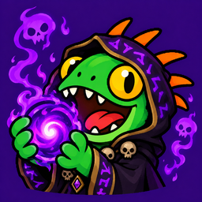

# HandyNotes: Seeking the Soulstones

**Made for alt-aholics.** Whether it's your first warlock or your fifteenth, the green fire questline is a rite of passage — and with more races than ever able to roll a warlock, there's always another one to take through it. This plugin takes the guesswork out of the trickiest step.

*Jubeka's Journal gives you riddles. This gives you pins.*

## What it does

During **Seeking the Soulstones**, you're sent across Outland to find four soulstone fragments with only vague journal clues to go on. This plugin puts a pin on each one:

- **Hellfire Peninsula** — Felspark Ravine, east of Thrallmar (plus a second spot near the Legion Front where some players find it)
- **Netherstorm** — Ruins of Farahlon
- **Blade's Edge Mountains** — Vim'gol's Circle, near the bridge to Netherstorm
- **Shadowmoon Valley** — Hand of Gul'dan, by the summoning circle

## Features

- Pins on each zone map and on the Outland continent map, so you can plan your route at a glance
- Each pin hides once you've collected that fragment, and everything hides once the quest is turned in
- Right-click any pin to set a map waypoint
- Only shows on warlocks by default — your other alts won't see clutter
- Adjustable icon size and transparency

## Before you head to Outland

The soulstones aren't the start of the green fire chain. You'll need to work through the earlier steps first:

1. Get a **Sealed Tome of the Lost Legion** — it drops from rare mobs on the **Isle of Thunder** (or check the Auction House).
2. Combine it with a **Healthstone** to start the chain.
3. Follow the quests through to **A Tale of Six Masters**, which hands you Jubeka's Journal.

*Then* it's time for this plugin to shine. Each warlock needs their own tome.

## Tips

- As you get close, you'll get a cold / warm / hot debuff. The fragment is a small purple shard on the ground.
- Stick around a moment after looting — three of the fragments play a short memory you need to watch.
- The Hellfire fragment gives quest credit but **no item in your bags**. That's normal.
- Save Shadowmoon Valley for last; the next step is at the Black Temple.

## Settings

Found in the HandyNotes plugin settings:

- Icon scale and transparency
- Only show on warlocks
- Hide fragments you've already collected
- Keep showing pins after the quest is turned in
- Show pins on the Outland continent map

## Requires

HandyNotes

## More from NerdyBertie

If this saved you some wandering around Outland, you might like these too:

- **HandyNotes: Dive Bar Front Crawl** — map pins for every underwater Tortollan dive bar in the Dive Bar Front Crawl housing endeavor
- **ItemWatch** — track how many of an item you have toward a goal, with a recipe shopping list that counts your bags, bank and warband bank
- **Boomkin Buff Watcher** — keeps Balance Druids on top of their Astral Power and Eclipse state
- **Holiday Herald** — friendly reminders when in-game holidays start, with links to their meta-achievements, goodies, secrets, more!

Find them all by searching **NerdyBertie** on CurseForge, WoWInterface or Wago.

## License

MIT

If you find this addon, or any of my other addons, useful, consider supporting me on
[Ko-fi](https://ko-fi.com/nerdybertie) — totally optional, but always
appreciated! You can also find me on
[Twitch](https://www.twitch.tv/nerdybertie),
[Tiktok](https://www.tiktok.com/@nerdybertie),
[YouTube](https://www.youtube.com/@nerdybertie), or
[Discord](https://discord.gg/bXbMR6rzcF) - NerdyBertie
